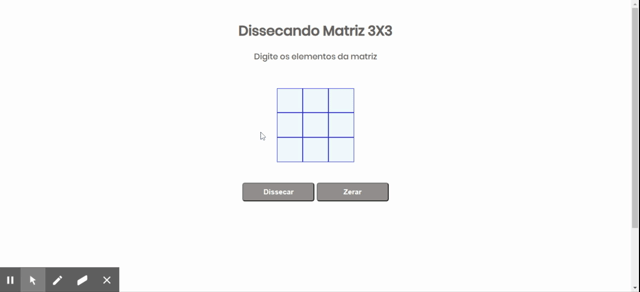

# Dissecando uma matriz 3X3

>Aplicaçao simples que calcula soma de elementos de uma matriz. 
>Sem utilizar inputs, o valor é digitado em div editável.

## Author 
:woman_technologist: **ViviRamos**

[*LinkedIn*](https://linkedin.com/in/viviane-ramos-luz-346169187)
